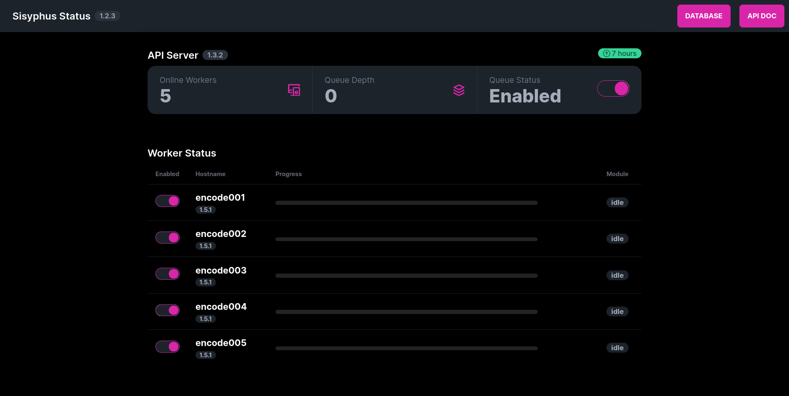

# Installing the Frontend



:::info

This is an optional part of Sisyphus, and it is not required to process jobs.  It does look pretty awesome though.

:::

## Description

The `sisyphus-frontend` is a React/Next.js webpage that gathers a ton of information from the API server and displays it on a single, easy-to-read webpage.

Information includes:
- Front-end, Server, and Client versions
- Client/worker progress, current task, and job name
- Currently connected workers
- API job queue depth
- Worker and queue statuses
- API server uptime

## Requirements

This is a simple React/Next.js website.  Please refer to the documentation on how to get this running in your setup if you don't want to use the included Docker Compose file.

## Environment Variables

### Docker Compose

There are only two environment variables that needs to be set: the URL to the API server, and the link

- `SISYPHUS_API_SERVER`: The address to the API server.  This must be set as there is no default value.
- `SISYPHUS_DB_SERVER`: The address to the Mongo Express server.  If this isn't defined, the **API DOC** button will just not work.

### Frontend Specific

The URL of the API server when running outside of Docker Compose is `NEXT_PUBLIC_SISYPHUS_API` and must be set prior to running/building the website.

You can also define `NEXT_PUBLIC_SISYPHUS_DB` to the Mongo Express server which will allow you to quickly peruse the API server Swagger documentation.

## Installation

:::caution

The `sisyphus-frontend` version **1.2.0** _requires_ `sisyphus-server` version **1.3.2** or greater!

:::

### Docker Compose

The Docker Compose file will build the `sisyphus-frontend` container and ensure that the website is built with the right information (i.e. the API url).  Failure to define that at build time will result in issues.

#### Procedure

1. Clone the [`sisyphus-frontend`](https://github.com/JamesTheBard/sisyphus-frontend) repository.

    ```bash
    git clone https://github.com/JamesTheBard/sisyphus-frontend
    ```

2. Navigate to the `docker` directory.

    ```bash
    cd sisyphus-frontend/docker
    ```

3. Run the Docker Compose file in the directory.

    ```bash title="Linux"
    export SISYPHUS_API_SERVER="http://api.server.url.here:5000"
    export SISPYHUS_DB_SERVER="http://mongoexpress.server.url.here:8081"
    docker compose up -d
    ```

    ```powershell title="Windows (PowerShell)"
    $Env:SISYPHUS_API_SERVER = "http://api.server.url.here:5000"
    $Env:SISPYHUS_DB_SERVER = "http://mongoexpress.server.url.here:8081"
    docker compose up -d
    ```

4. The container can take a minute or two to build.  However, after the service is up, navigate to `http://localhost:3000` and verify that the expected information is there.
